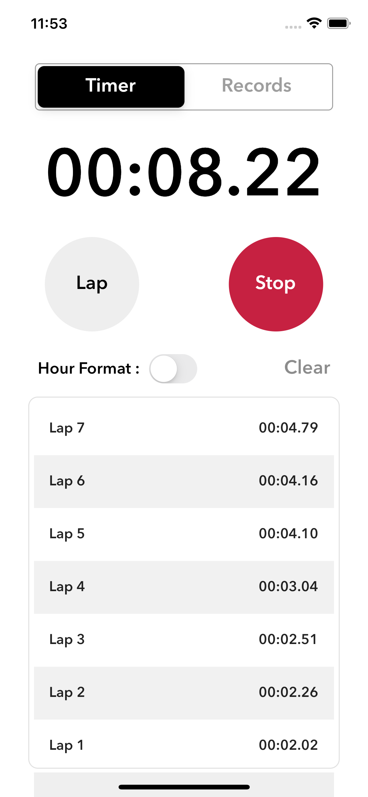
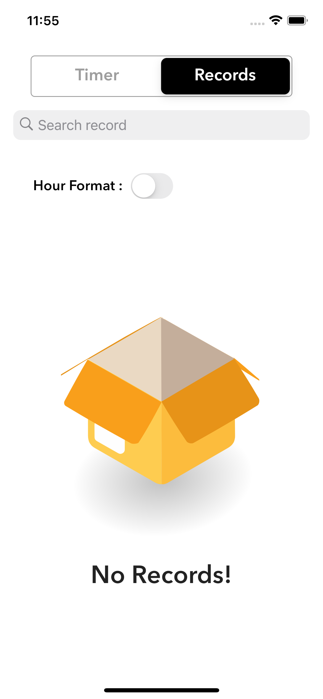
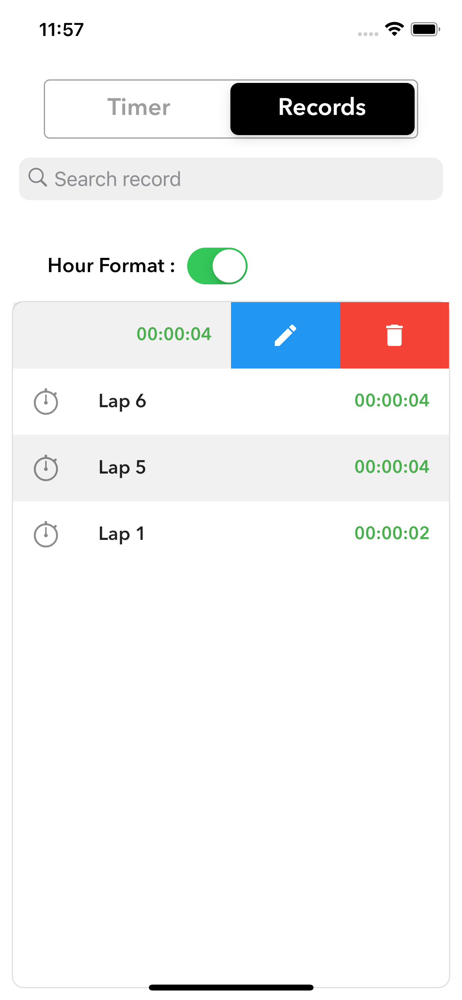

# StopWatch : A flutter app

## Explore the app UI
|Timer Screen|Records screen (1)|Records screen (2)|
|---|---|---|
||||

## Basic functionalities
-  Start / Stop timer button
-  Lap / Reset button:
	-  Lap button : records the laps from the overall timer.
	-  Reset button : resets the overall timer and clears the laps
records
-  List of laps
-  Save laps with a title as a record
-  Search records
-  Edit record title
-  Delete record

## Bonus functionalities
-  Records should persist even on app re-open
-  Row animation when a lap is added to the list
-  Delete lap row animation
-  Hour-Format conversion switch

## Steps to run my app
1. Assuming flutter is installed on the computer, 
	> if not, install flutter from [here](https://docs.flutter.dev/get-started/install)
	- check your flutter installation is properly done or not with `flutter doctor -v`
2. go to main directory i.e. which contains `lib`,`ios`,`android` files
3. see available devices with `flutter devices`
4. select any available device name and append it to following command
	- `flutter run -d <your-device-name>`
- additional : 
	- To run on any iphone on release mode which has name `Aayush’s iPhone` displayed under devices section, run `flutter run -d 'Aayush’s iPhone' --release`
	- For building release apk for android, run following command `flutter  build apk --release`

### See `.apk` file [here](./assets/apk/StopWatch.apk)

### See *Screen Recording*  [here](./assets/screen-recording/stopwatch.MP4)

# Author
- Name : Aayush Shah
- Roll Number : 19BCE245
- College : Nirma University

---

# Additional documentation for my future self 

- Approach and solution
	- first created the timer logic
	- switch for hour - minutes format conversion
	- lap logic
	- lap model for storing laps data
	- timer screen UI
	- record screen UI
	- modularisation of code
	- record screen logic with lap class and json,map,string parsing for local storage
	- animations
		- lottie flies, row animations
	
- Loopholes
	- upon rotation lap screen is hidden
	
- possible improvements
	- new feature of resume from existing stored lap.
	- UI changes for different sized devices
	- More animations and custom clock
	- adding timer function which starts time from reverse and plays sound upon finishing.
	
- problems faced during assignment
	- representation of timer
		- solved with switch
	- color overflow in listview builder
		- solved by adding column and container color in parent
		- covering scaffold with another container for statusbar color overflow problem
	- laps disappearing/reseting when switching b/w records and timer
		- initialcount set to zero so i defaulted it to laps.length
	- storage structure of laps
		- solved by creating model class for each lap
	- how to store object list in local storage
		- converting object list into json with mapping and parsing it to single string then storing it with sharedpreferences.
		- encoding and decoding of the same
	
---

*ps : this app was developed by me during the hiring process of [toddle](https://www.toddleapp.com/) company's mobile app developer role in 24 hours!*